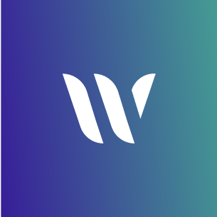

<!--
SPDX-FileCopyrightText: 2025 2025 INDUSTRIA DE DISEÑO TEXTIL S.A. (INDITEX S.A.)

SPDX-License-Identifier: Apache-2.0
-->

<!-- Improved compatibility of back to top link: See: https://github.com/othneildrew/Best-README-Template/pull/73 -->

<a id="readme-top"></a>

<!--
*** Thanks for checking out the Best-README-Template. If you have a suggestion
*** that would make this better, please fork the repo and create a pull request
*** or simply open an issue with the tag "enhancement".
*** Don't forget to give the project a star!
*** Thanks again! Now go create something AMAZING! :D
-->

<!-- PROJECT SHIELDS -->
<!--
*** I'm using markdown "reference style" links for readability.
*** Reference links are enclosed in brackets [ ] instead of parentheses ( ).
*** See the bottom of this document for the declaration of the reference variables
*** for contributors-url, forks-url, etc. This is an optional, concise syntax you may use.
*** https://www.markdownguide.org/basic-syntax/#reference-style-links
-->

[![Contributors][contributors-shield]][contributors-url]
[![Forks][forks-shield]][forks-url]
[![Stargazers][stars-shield]][stars-url]
[![Issues][issues-shield]][issues-url]
[![project_license][license-shield]][license-url]

<!-- PROJECT LOGO -->
<br />
<div align="center">
  <a href="https://github.com/InditexTech/weavejs">
    <picture>
      
    </picture>
  </a>

<h3 align="center">Weave.js Backend Showcase</h3>

  <p align="center">
    Build visual collaborative tools like Excalidraw, Miro, Canva, or Figma!
    <br />
    <a href="https://github.com/InditexTech/weavejs-backend"><strong>Explore the docs »</strong></a>
    <br />
    <br />
    <a href="https://github.com/InditexTech/weavejs-backend">View Demo</a>
    &middot;
    <a href="https://github.com/InditexTech/weavejs-backend/issues/new?labels=bug&template=bug-report.md">Report Bug</a>
    &middot;
    <a href="https://github.com/InditexTech/weavejs-backend/issues/new?labels=enhancement&template=feature-request.md">Request Feature</a>
  </p>
</div>

<!-- TABLE OF CONTENTS -->
<!-- <details>
  <summary>Table of Contents</summary>
  <ol>
    <li>
      <a href="#about-the-project">About The Project</a>
      <ul>
        <li><a href="#built-with">Built With</a></li>
      </ul>
    </li>
    <li><a href="#license">License</a></li>
    <li><a href="#contact">Contact</a></li>
  </ol>
</details> -->

<!-- ABOUT THE PROJECT -->

## About The Project

[![Weave.js Screen Shot][product-screenshot]](images/screenshot.png)

This repository contain the Weave.js showcase backend, its a demo of a backend that handles
the real-time collaboration infrastructure for the Weave.js showcase frontend. It serves as the server-side component that:

- 🌐 Manages room sessions and user connections
- 🔄 Handles real-time synchronization of canvas state (e.g. using Yjs or WebSocket)
- 👥 Supports multi-user presence, awareness, and broadcasting
- 🔐 May include persistence, authentication, or permission logic

This backend is designed to demonstrate how Weave.js can be integrated into a full-stack collaborative environment, enabling live shared editing across clients.

<!-- <p align="right">(<a href="#readme-top">back to top</a>)</p> -->

### Built With

- [Express.js](https://expressjs.com/)

<!-- <p align="right">(<a href="#readme-top">back to top</a>)</p> -->

### Related repos

- [Weave.js](https://github.com/InditexTech/weavejs)
- Weave.js [showcase frontend](https://github.com/InditexTech/weavejs-frontend)

<!-- <p align="right">(<a href="#readme-top">back to top</a>)</p> -->

## Quickstart

You can locally launch the backend showcase by:

- Install dependencies with: `npm install`
- Create a `.env` file on the folder `/code`, and setup the necessary configuration:

  ```
  HOSTNAME=0.0.0.0
  PORT=8081
  LOG_LEVEL=debug

  AZURE_WEB_PUBSUB_ENDPOINT=<azure-web-pubsub-endpoint>
  AZURE_WEB_PUBSUB_KEY=<key>
  AZURE_WEB_PUBSUB_HUB_NAME=weavejs
  PERSIST_FREQUENCY_SEG=10

  AZURE_STORAGE_CONNECTION_STRING=<azure-storage-connection-string>
  AZURE_STORAGE_ROOMS_CONTAINER_NAME=rooms
  AZURE_STORAGE_IMAGES_CONTAINER_NAME=images
  ```

- Run the frontend: `npm run dev`

You'll need access to a:

- [Azure Web PubSub](https://azure.microsoft.com/es-es/products/web-pubsub) instance.
- [Azure Blob Storage](https://azure.microsoft.com/es-es/products/storage/blobs) instance.

<!-- LICENSE -->

## License

This project is licensed under the terms of the [Apache-2.0](LICENSE) license.

© 2025 INDUSTRIA DE DISEÑO TEXTIL S.A. (INDITEX S.A.)

<p align="right">(<a href="#readme-top">back to top</a>)</p>

<!-- MARKDOWN LINKS & IMAGES -->
<!-- https://www.markdownguide.org/basic-syntax/#reference-style-links -->

[contributors-shield]: https://img.shields.io/github/contributors/InditexTech/weavejs.svg?style=for-the-badge
[contributors-url]: https://github.com/InditexTech/weavejs-backend/graphs/contributors
[forks-shield]: https://img.shields.io/github/forks/InditexTech/weavejs.svg?style=for-the-badge
[forks-url]: https://github.com/InditexTech/weavejs-backend/network/members
[stars-shield]: https://img.shields.io/github/stars/InditexTech/weavejs.svg?style=for-the-badge
[stars-url]: https://github.com/InditexTech/weavejs-backend/stargazers
[issues-shield]: https://img.shields.io/github/issues/InditexTech/weavejs.svg?style=for-the-badge
[issues-url]: https://github.com/InditexTech/weavejs-backend/issues
[license-shield]: https://img.shields.io/github/license/InditexTech/weavejs.svg?style=for-the-badge
[license-url]: https://github.com/InditexTech/weavejs-backend/LICENSE.txt
[product-screenshot]: images/screenshot.png
[Konva-url]: https://github.com/konvajs/konva
[Yjs-url]: https://github.com/yjs/yjs
[SyncedStore-url]: https://github.com/yousefed/SyncedStore
